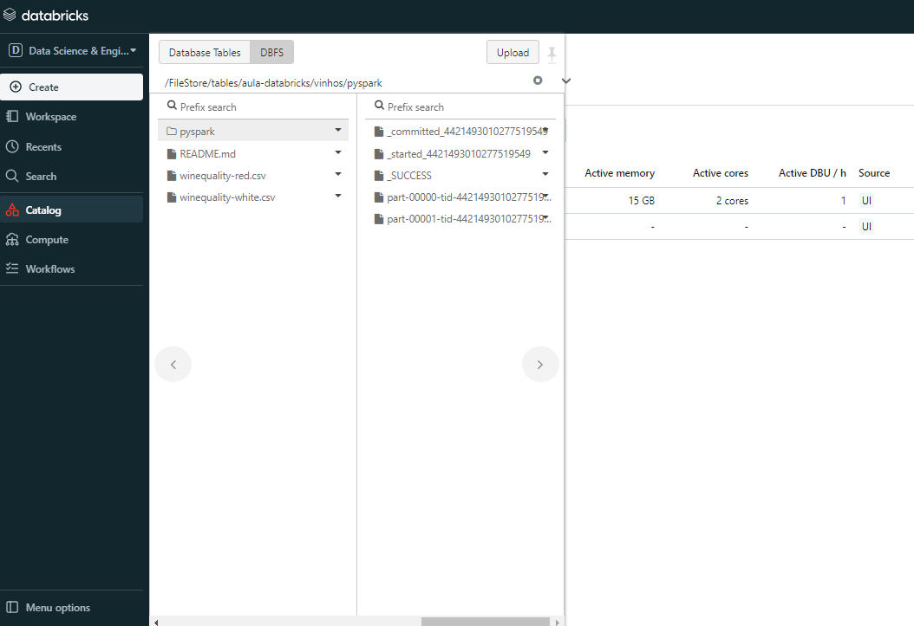

# Explorando Databricks: Uma Jornada pelas Principais Habilidades com Análise de Dados

## 💡Objetivos
Este projeto de exploração do Databricks abrangeu diversos tópicos, destacando as principais habilidades adquiridas ao longo do caminho:

**1. Configuração Inicial:**
    - Criação de clusters para processamento no Databricks.
    - Utilização de notebooks para desenvolvimento e execução de código.

**2. Gestão de Dados:**
    - Exploração e compreensão do Databricks File System (DBFS).
    - Criação de tabelas no ambiente de notebook para organização de dados.

**3. Utilidades e Manipulação de Arquivos:**
    - Familiarização com comandos utilities para manipulação eficiente de arquivos.
    - Exploração de datasets, diretorios e manipulação de arquivos no ambiente Databricks.

**4. Integração com Apache Hive:**
    - Integração e utilização do Apache Hive no contexto do Databricks.
    - Execução de consultas SQL diretamente no Databricks.

**5. Exploração de Dados com Apache Spark:**
    - Introdução ao Apache Spark e sua comunicação eficiente com o Apache Hive.
    - Criação de DataFrames utilizando PySpark para manipulação e análise de dados.

**6. Análise de Dados com Databricks:**
    - Aplicação das habilidades adquiridas para a análise eficaz de conjuntos de dados.
    - Utilização de funcionalidades avançadas do Databricks para insights valiosos.

Essa jornada proporcionou um entendimento profundo do ecossistema Databricks, capacitando para a criação e gestão de clusters, desenvolvimento eficiente com notebooks, manipulação eficaz de dados utilizando SQL e Spark, e a habilidade de integrar diversas ferramentas para análise e exploração de dados, culminando na realização de análises de dados avançadas com o Databricks.

###### Imagem 1: Pagina Inicial Databricks

## 📄Desenvolvimento de Competências:
|Atividades|Realizadas |
|----------|-----------|
| Compreender a criação do Databricks | Criar uma conta na versão Community |
| Conhecer o workspace da plataforma Databricks | Localizar as ferramentas básicas da plataforma do Databricks |
| Criar e clonar um cluster | Criar e importar notebooks para a área de trabalho no Databricks |
| Subir arquivos no DBFS e criar tabelas com o conteúdo destes arquivos | Conceituar os comandos básicos do Databricks Utilities (dbutils) |
| Manipular arquivos no DBFS com os comandos do fs do dbutils | Datasets do Databricks para colocar em prática os conhecimentos na plataforma |
| Copiar e mover arquivos entre diretórios | Explicar sobre o Hive no Databricks |
| Utilizar SQL em um notebook no Databricks | Criar database e tabelas |
| Criar partições | Carregar dados em uma tabela |
| Explorar os dados de uma tabela com instruções SQL | Juntar informações de mais de uma tabela |
| Conceituar o Apache Spark | Transformar tabelas do Hive em Dataframes |
| Reconhecer e utilizar o PySpark | Utilizar a linguagem Python para trabalhar com dados no Spark |

##  🗂️Estrutura de Arquivos no Repositório:
* Notebook | Explorando Databricks Parte 01 e 02
    O material proporciona insights sobre como criar e utilizar o Databricks, desde a criação de uma conta na versão Community até a manipulação de arquivos no DBFS, criação de clusters, importação de notebooks, utilização do SQL em notebooks, criação de databases e tabelas, carregamento de dados, exploração de dados com SQL, conceitos do Apache Spark e uso do PySpark para trabalhar com dados no Spark.

* Notebook | Análise Exploratória Databricks
    Investigação e compreensão aprofundada de conjuntos de dados, proporcionando uma visão abrangente e buscando atribuir significado aos dados para extrair conhecimento valioso.

* Base da Dados
    Arquivo CSV contendo material para a exploração e análise de dados utilizando o Databricks.

## 🎞️ Imagens do Projeto

###### Imagem 2: DBFS File Browser

###### Imagem 3: DBFS File Browser

## 🔍Referências
- [Alura](https://www.alura.com.br/)
